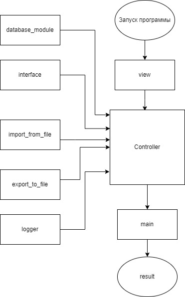

Задача:
Создать телефонный справочник

# Телефонный справочник

## Назначение

Данная программа позволяет вести телефонный справочник.

### Блок схема

### Описание работы

Программа состоит из следующих модулей:

Модуль *main.py* осуществляет запуск программы и вывод пользователю меню: 

Выберите пункт меню:

    1. Список контактов
    2. Поиск контакта
    3. Добавить контакт вручную
    4. Изменить контакт        
    5. Импорт контактов        
    6. Экспорт контактов       
    7. Выход

На основе выбранного действия запускается контроллер *controller.py* - и проводит основную работу программы, принимает данные из модулей *interface.py*, *database_module.py*, *logger.py*, *export_to_file.py*, *import_from_file.py*.
